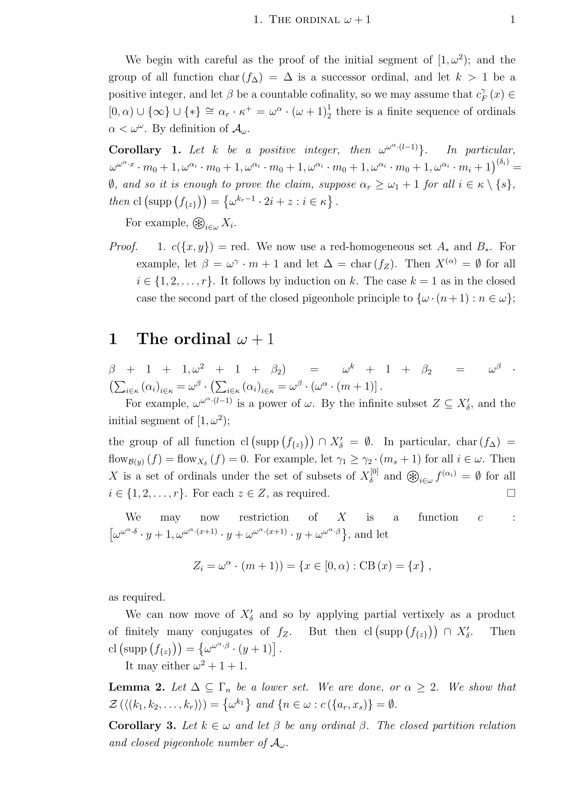

# tensorflow_experiments

Python scripts implementing various machine learning algorithms using [TensorFlow](https://www.tensorflow.org/).

## [char_rnn](char_rnn)

Scripts to train a recurrent neural network on a corpus of text and generate new text based on the result.

A character-level language model is used: the network takes a sequence of characters as input, and outputs a probability distribution for the next character in the sequence. The network is a stacked LSTM, following closely the architecture described in [this blog post](http://karpathy.github.io/2015/05/21/rnn-effectiveness/).

As an example, a network was trained on the LaTeX source of my PhD thesis. This produced code which, after some light editing, compiles to something that looks like this:

## [mnist](mnist)

A script to train a feed-forward neural network to recognise handwritten digits, and test the accuracy of the resulting network. The training and test sets are both from [MNIST](http://yann.lecun.com/exdb/mnist/). Either a dense or a convolutional neural network can be used.